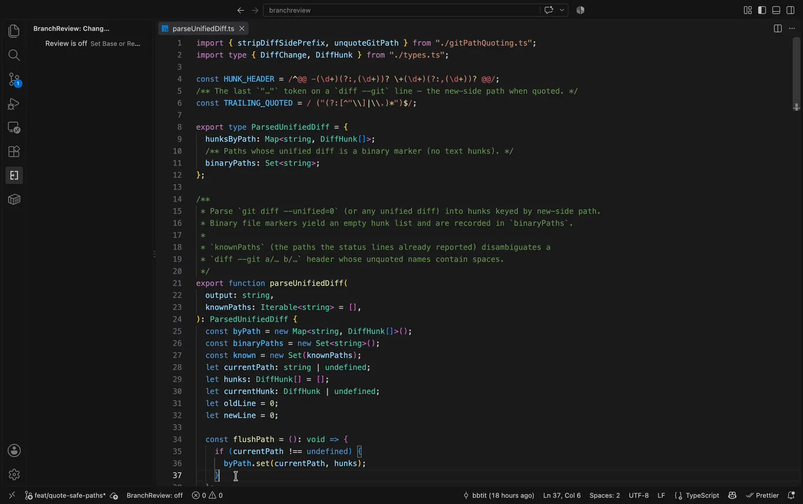
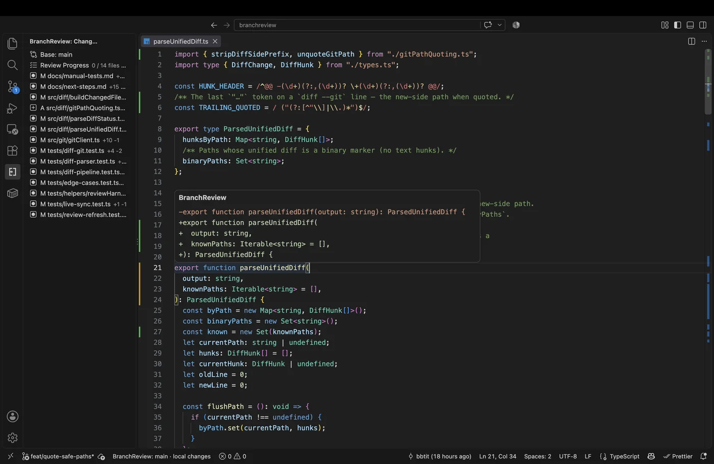
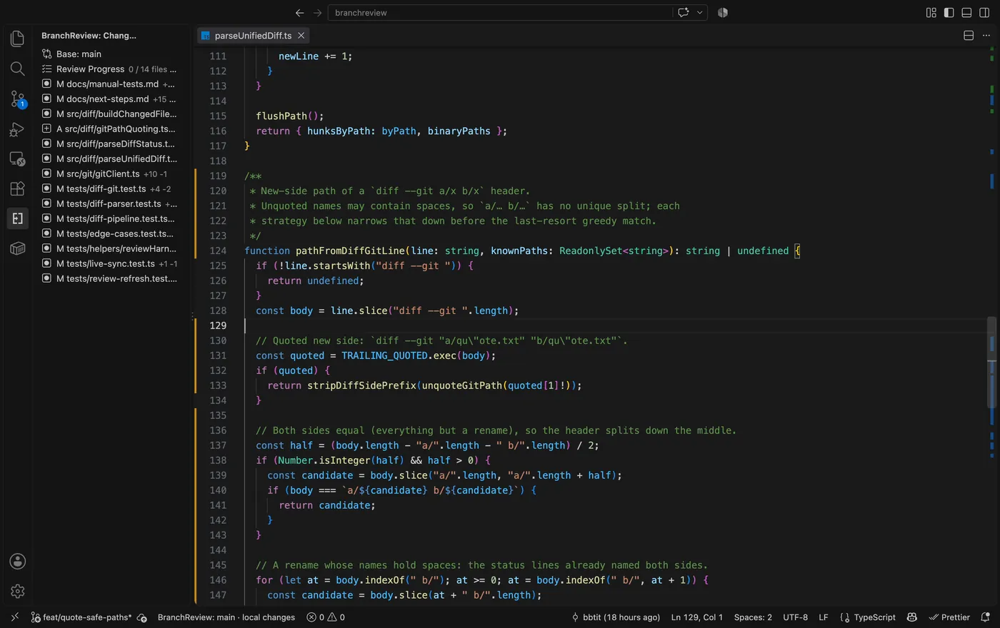
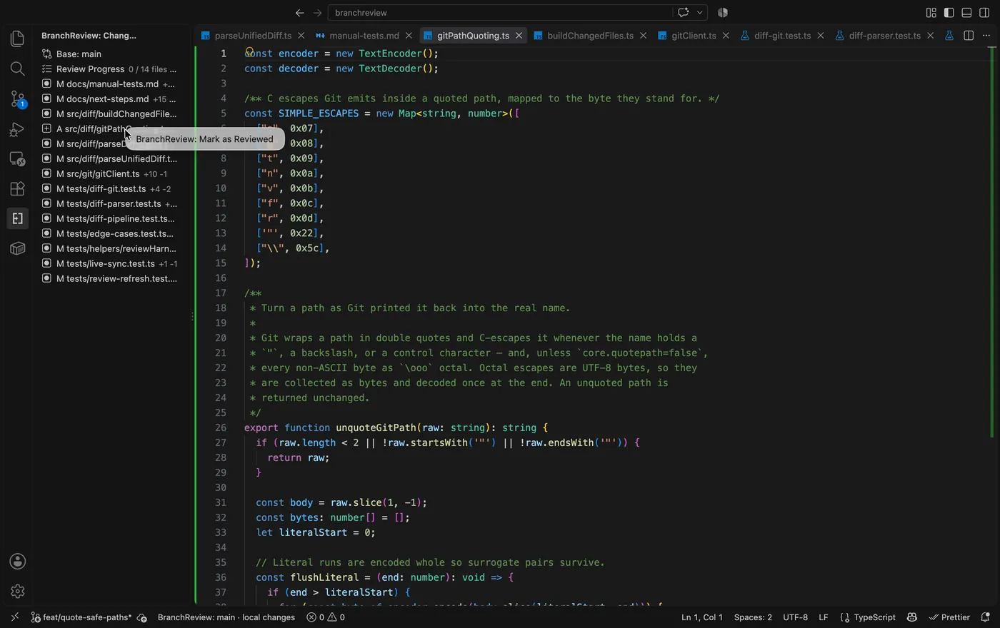

# BranchReview

_English: [README.md](./README.md)_

従来の差分表示はノイズが多くなりがちです。変更前と変更後が左右に並び、消えた行も画面に残る。エディタの機能もすべて使えるとはかぎりません。

BranchReview は、レビュー対象のブランチを普通のエディタで開いたまま、ブランチ間の差分を gutter のマークと hover で表示します。実際のファイルを開くので、エディタ本来の機能もすべて使えます。差分ではなく変更後のコードにより集中するための VS Code 拡張です。

## 使い方

### 1. レビューしたいブランチに checkout

```zsh
git checkout feat/⚪︎⚪︎⚪︎
```

### 2. `BranchReview: Set Base`

コマンドパレット（Windows: `Ctrl+Shift+P`、MacOS: `Cmd+Shift+P`）で `BranchReview: Set Base` を実行し、比較対象を選びます。

ステータスバーの `BranchReview: off` を押下することでも比較対象を選択可能です。

準備はこれだけです。ステータスバーの表示が `BranchReview: off` から `BranchReview: main` に変わります。



### 3. gutter のマークが変更行を示す

あとはいつもどおりファイルを開くだけです。変更のある行には、gutter にマークが付きます。

| マーク | 意味                                                             |
| ------ | ---------------------------------------------------------------- |
| 追加   | このブランチで足された行                                         |
| 変更   | このブランチで書き換えられた行                                   |
| 削除   | このブランチで消された行。マークは消えた位置の隣、残った行に付く |

**マークにマウスを載せると**、その hunk が diff として出ます。書き換えられる前の行も、消された行も、ここで全文を読めます。ファイルの中身には何も挿入しません。



### 4. `Alt+]` で次の変更へ飛ぶ

`Alt+]` で次の変更、`Alt+[` で前の変更に移動します。移動は**ファイルをまたぎます**。最後の変更まで行くと先頭に戻ります。まだ開いていないファイルへ飛んだときは、そのファイルが普通に開きます。



アクティビティバーの **BranchReview → Changes** には、変更されたファイルが `+n -n` 付きで並びます。クリックすれば、そのファイルが開きます。

### 5. 読み終えたファイルに印を付ける

Changes ビューでファイルを右クリックし、**Mark as Reviewed** を選ぶと ✓ が付き、進捗の行が増えます（`1 / 14 files reviewed`）。



進捗はリポジトリ・base・ブランチの組ごとに覚えています。同じブランチに新しいコミットが載っても、読み終えた印は消えません。

### 6. 中断しても base は残る

**`BranchReview: Stop Review`** で overlay を止めます。base は覚えたままなので、**`Resume Review`** で続きから再開できます。ウィンドウを再読み込みしたあとでも同じです。base ごと捨てるときは **`Clear Base`** を使います。このときは進捗も一緒に消えます。

レビュー中、ステータスバーには `BranchReview: <base>` が出ます。作業ツリーに未コミットの変更があるときは、末尾に `· local changes` が付きます。gutter が映しているのがコミット範囲であって手元の編集ではないことを、ここで区別できます。

## コマンド

| コマンド                                                      | 何をするか                                              |
| ------------------------------------------------------------- | ------------------------------------------------------- |
| `BranchReview: Set Base`                                      | 比較相手を選んでレビューを始める                        |
| `BranchReview: Resume Review`                                 | 覚えている base でレビューを再開する                    |
| `BranchReview: Stop Review`                                   | overlay を止める。base は残す                           |
| `BranchReview: Clear Base`                                    | base と進捗を捨てる                                     |
| `BranchReview: Next Change` / `Previous Change`               | ファイルをまたいで次 / 前の変更へ移動する               |
| `BranchReview: Mark as Reviewed` / `Mark as Unreviewed`       | Changes ビューでファイルの既読・未読を切り替える        |
| `BranchReview: Clear All Review Progress for This Repository` | このリポジトリの進捗を全 base・全ブランチ分まとめて消す |
| `BranchReview: Show Git Context`                              | リポジトリの root・ブランチ・HEAD を表示する（調査用）  |

## キーバインド

| ショートカット              | コマンド        |
| --------------------------- | --------------- |
| `Alt+]`（macOS `Option+]`） | Next Change     |
| `Alt+[`（macOS `Option+[`） | Previous Change |

## 引っかかりやすいところ

- **未コミットの変更はレビューに入りません。** gutter は常に `base...HEAD` を映します。手元の編集は混ぜずに、ステータスバーで知らせます
- **削除されたファイルは開きません。** Changes ビューには出ますが、開く先のファイルがもう存在しないためです
- **バイナリファイルに gutter は付きません。** 一覧には `binary` と出ます
- **detached HEAD ではレビューを始められません。** 先にブランチを checkout してください
- レビュー中にブランチを切り替えると、overlay は自動で止まります。base は残るので `Resume Review` で戻れます

## 動作環境

- VS Code 1.96 以降
- `git` に PATH が通っていること

## 開発

```bash
pnpm install
pnpm check   # oxlint + oxfmt + 型チェック
pnpm test    # vitest
pnpm build   # dist/extension.cjs にバンドル
```

**F5** で Extension Development Host が起動します。ツールチェーンは [Vite+](https://viteplus.dev/)（`vp`）で、ESLint・Prettier・Jest・webpack は意図的に使っていません。

- [`docs/requirements.md`](./docs/requirements.md)：要件
- [`docs/decisions.md`](./docs/decisions.md)：実装上の決定と、その理由
- [`docs/research-vscode-apis.md`](./docs/research-vscode-apis.md)：設計の土台にした VS Code API 調査
- [`docs/manual-tests.md`](./docs/manual-tests.md)：手動テストの手順
- [`docs/next-steps.md`](./docs/next-steps.md)：残っている作業

## 困ったときは

動かない、挙動がおかしい、こういう機能が欲しい。どれも [GitHub issues](https://github.com/bbtit/branchreview/issues) で受け付けています。

## ライセンス

[MIT](./LICENSE)
